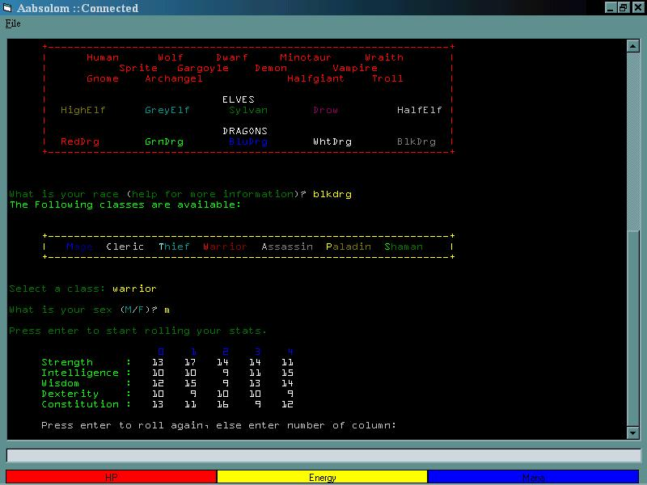



## MUD Client

### Description

It was originally made for to go with the BeMUD program posted a little while back. I finally got back from school long enough to post this. I made it several months ago but it seems to still be working just fine. Probably one of my better pieces of work as a beginner. =P

I thought about it and realized I should note that I am not the author of BeMUD. I asked the author of BeMUD (back while he was making it) if he wanted my help, he told me to make this.
 
### More Info
 

             |
---                |---
**Submitted On**   |2000-10-26 00:43:50
**By**             |[J\. B\.](https://github.com/Planet-Source-Code/PSCIndex/blob/master/ByAuthor/j-b.md)
**Level**          |Beginner
**User Rating**    |5.0 (15 globes from 3 users)
**Compatibility**  |VB 6\.0
**Category**       |[Games](https://github.com/Planet-Source-Code/PSCIndex/blob/master/ByCategory/games__1-38.md)
**World**          |[Visual Basic](https://github.com/Planet-Source-Code/PSCIndex/blob/master/ByWorld/visual-basic.md)
**Archive File**   |[MUD Client250188212001\.zip](https://github.com/Planet-Source-Code/j-b-mud-client__1-26431/archive/master.zip)

